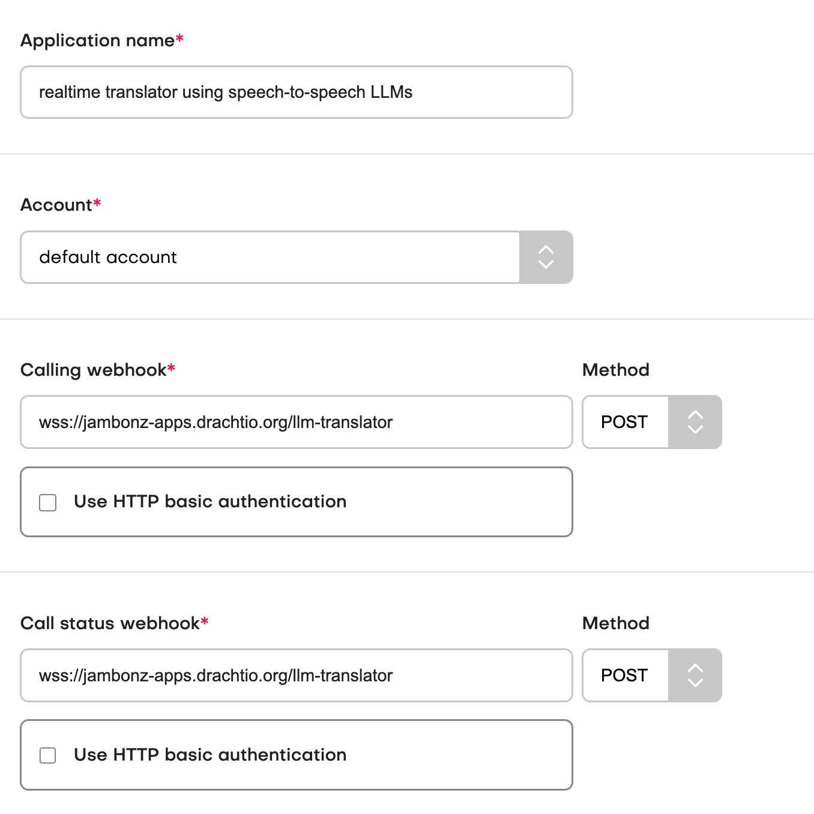

# jambonz-realtime-translator-using-llms

This is an example jambonz websocket application which connects two parties and provides real-time translation of their 
speech to each other using either [OpenAI](https://platform.openai.com/docs/guides/realtime) or [Ultravox](https://www.ultravox.ai/).  

It illustrates the use of several jambonz features, including:
- [placing calls](https://docs.jambonz.org/verbs/verbs/dial) through sip trunks or to registered users,
- layering multiple audio tracks into an audio conversation using [dub tracks](https://docs.jambonz.org/guides/features/dub-tracks)
- lowering the volume on a call if desired.

You choose which LLM you want to use by providing **one* of the following environment variables:
- ULTRAVOX_API_KEY, or
- OPENAI_API_KEY

## Running the app

> Requires jambonz 0.9.3-8 or above

```bash
npm install
ULTRAVOX_API_KEY=XXXXXXXXXXXXX \
CALLED_PARTY_LANGUAGE=English \
CALLING_PARTY_LANGUAGE=Spanish \
LOWER_VOLUME=-10dB \
node app.js
```

## Configuring jambonz

On your jambonz system, create an Application that uses a websocket URL with a path of "/llm-translator", as shown below.



## How it works
When an incoming call is routed to this application, it will generate a dialed call to the phone number in the 
To header of the incoming call, by default.  If you want to override this to dial a different number you can 
specify the OUTBOUND_OVERRIDE env var as described below.

Then the call is connected audio streams from both parties are sent to OpenAI with a prompt to provide 
translations; as translated speech is received it is streamed to the other caller in realtime over a dub 
track that was added to that speaker's channel.  That way the speaker can hear the native speaker as well as 
the translation, but the volume of the native speaker can be turned down if desired using the LOWER_VOLUME env.

## Configuration variables

|var| description|required|
|-------|--------|-------|
|ULTRAVOX_API_KEY|Your Ultravox.ai api key|no|
|OPENAI_API_KEY|Your OpenAI api key|no|
|CALLED_PARTY_LANGUAGE|Name of the language of the called party|yes|
|CALLING_PARTY_LANGUAGE|Name of the language of the calling party|yes|
|CALLER_ID_OVERRIDE|Override the caller id on the outbound call, defaults to inbound caller id if not provided|no|
|OUTBOUND_OVERRIDE|Dial a different number than that received on the incoming INVITE.  See details below|no|
|LOWER_VOLUME|number of decibels to decrease the speaker's volume so the translator is easier to hear, format must be "-5dB"|no|

### OUTBOUND_OVERRIDE

This environment variable forces the outbound call to a specific destination, which could be a phone number, 
a sip uri, or a registered user.  If this variable is not provided, then the outExamples of usage:

```
OUTBOUND_OVERRIDE=phone:16173333456
```
dials the phone number 1 (617) 333-3456 through one of your jambonz sip trunks

```
OUTBOUND_OVERRIDE=user:daveh@beachdog.sip.jambonz.cloud
```
dials the sip endpoint that has previously registered with jambonz for the given name

```
OUTBOUND_OVERRIDE=sip:1627444456@mypbx.com
```
dials the sip uri specified


